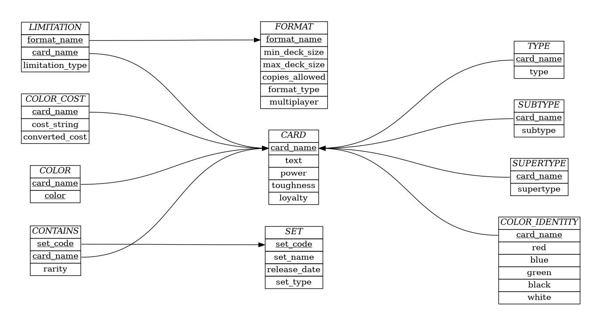

# CS 421 Database Project
Trumark is a database system that implements a website front end to facilitate querying of the database. Queries are string based using a tag systems "inspired" (read ripped) from [scryfall](https://scryfall.com/docs/syntax).

## Todo
* <s>should color_identity in the CARD table be a multivalued attribute? (lands can be identified as having one or more colors)?</s>
* <s>update schema to reflect the intended implementation</s>
* implement search box stump
* <s>database implementation</s>
* magic card data mass import

## Implementation

### Front/Back end
- python (with the [flask framework](https://palletsprojects.com/p/flask/))

### Database
- [SQLite](https://sqlite.org/index.html)

Note: SQLite database files can be interacted with via the command line ([link](https://sqlite.org/cli.html))

#### Schema
[Diagram Documentation](documentation/documentation.pdf)

Note: as the schema/documentation is updated the diagram/document must be recompiled (using the make files) so the changes are reflected visually.

## Dependencies
- python 3.3+
- python-flask
- python-sqlalchemy
- python-flask-bootstrap
- python-flask-wtf
- python-flask-wtforms
- SQLite

## Developed by:
- John **K**uroda
- Akil **Mar**shall
- Israel **Tru**sdell
